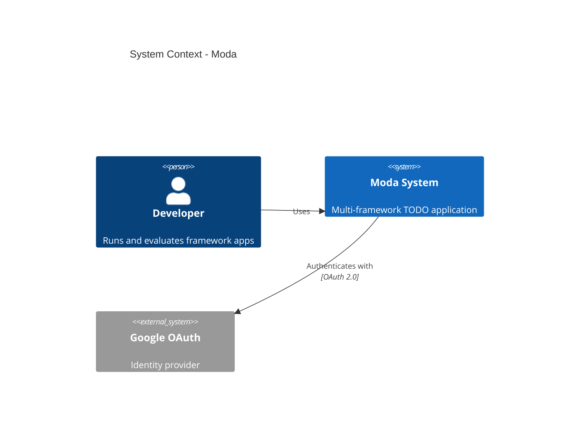
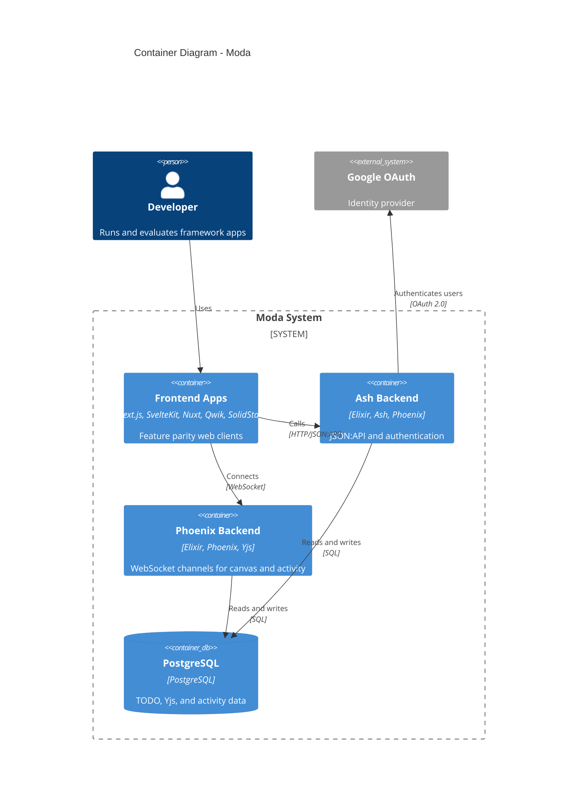
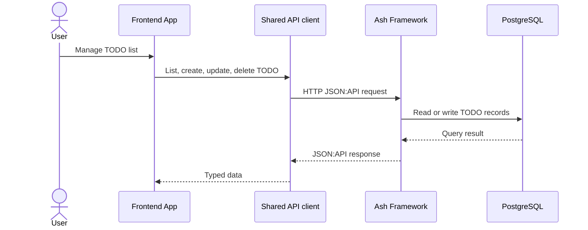
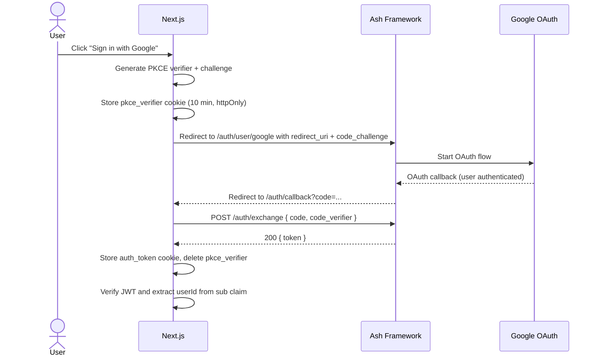
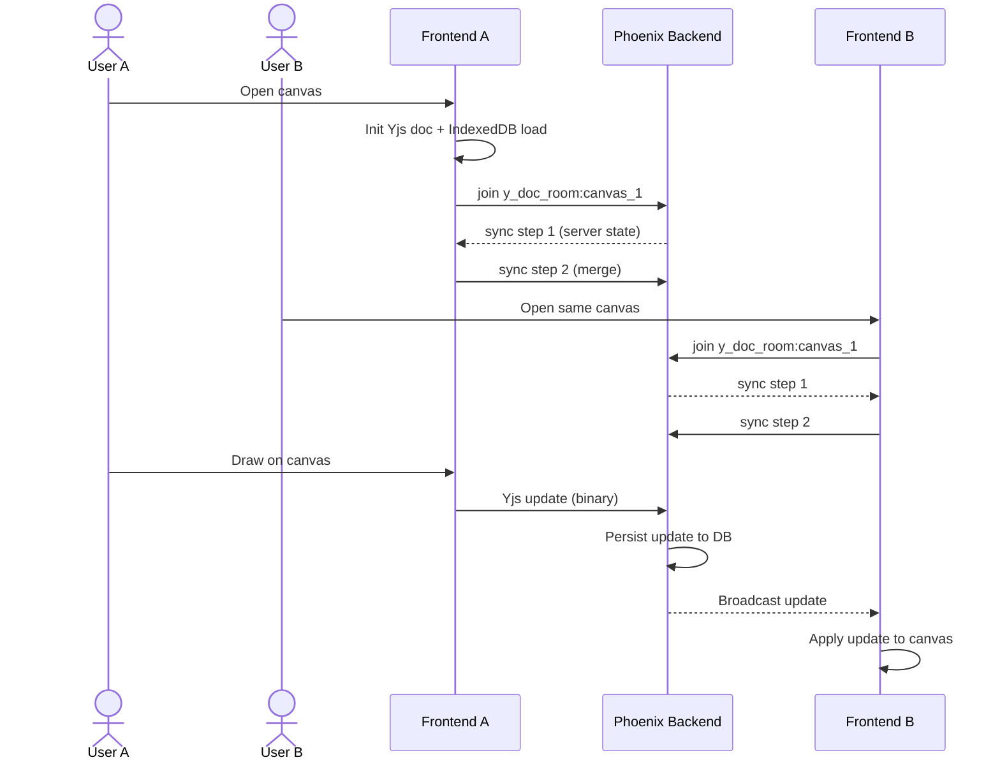
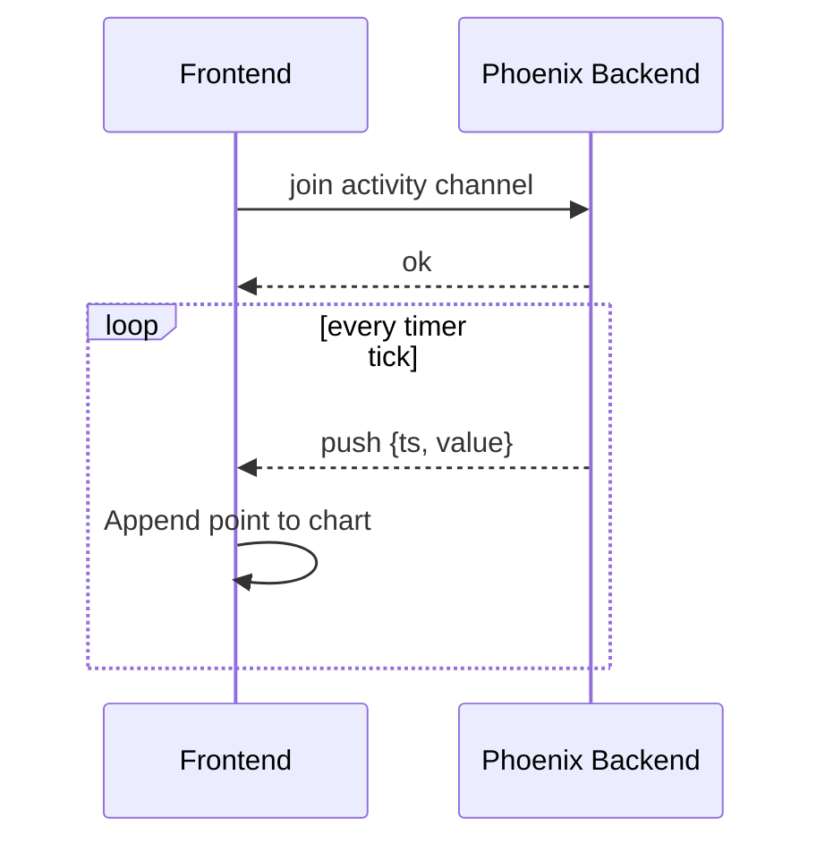
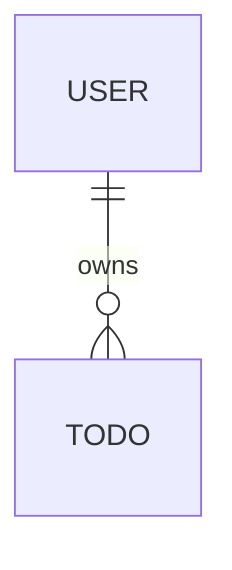

# Design Doc - Moda: Multi-Framework TODO Application

## Metadata

- Subject: Multi-framework TODO app in Nx monorepo
- Owner: Max
- Reviewers: -
- Status: draft
- Depth: standard
- Related docs:
  - Project overview: [docs/README.md](README.md)
  - ADR links: [ADR-001](adr/001-monorepo-tooling.md), [ADR-002](adr/002-ash-backend.md),
    [ADR-003](adr/003-phoenix-channels.md), [ADR-004](adr/004-api-contract.md), [ADR-005](adr/005-styling-approach.md),
    [ADR-006](adr/006-todo-canonical-resource.md)

## Summary

Moda is a learning project whose goal is to cover as many frontend frameworks as practical by building the same tabbed
app in each. The app has three independent tabs - Tasks (TODO CRUD), Canvas (collaborative whiteboard), Activity (live
chart) - chosen to exercise three distinct integration patterns: HTTP request-response, bidirectional CRDT sync, and
server-push streaming. The initial framework set like Next.js, SvelteKit, Nuxt, Qwik, and SolidStart, with no fixed
upper limit on how many frameworks can be added over time, using a shared Ash/Phoenix backend and TypeScript API client
in an Nx monorepo. The design keeps shared infrastructure framework-agnostic so each app implements its own integration
patterns, maximizing per-framework learning.

## Context and scope

- Problem: Isolated toy apps miss the integration friction (auth, WebSocket, codegen, monorepo) that determines real
  framework viability. See [project overview](README.md).
- Goals: Functional parity across the current framework set, apples-to-apples comparison.
- Non-goals: Production quality, pixel-perfect UI consistency, backend optimization.
- System context: Nx monorepo with two Elixir backends, one shared TS package, and a growing set of frontend apps.

## Architecture overview

### System context

### Main components

| Component                | Technology           | Responsibility                                                |
| ------------------------ | -------------------- | ------------------------------------------------------------- |
| `apps/nextjs`            | Next.js 16, React 19 | Frontend TODO app - feature parity implementation             |
| `apps/sveltekit`         | SvelteKit, Svelte 5  | Frontend TODO app - feature parity implementation             |
| `apps/nuxt`              | Nuxt 3, Vue 3        | Frontend TODO app - feature parity implementation             |
| `apps/qwik`              | Qwik City            | Frontend TODO app - feature parity implementation             |
| `apps/solidstart`        | SolidStart, Solid.js | Frontend TODO app - feature parity implementation             |
| `apps/ash_framework`     | Ash v3, Phoenix 1.8  | HTTP API and auth for TODO resources                          |
| `apps/phoenix_framework` | Phoenix 1.8, Yjs     | WebSocket services for collaborative canvas and activity feed |
| `packages/shared`        | TypeScript, axios    | Shared SDK, types, design tokens, and cross-app utilities     |

### Container diagram

## Key interactions

#### CRUD flow

#### Auth flow

#### Yjs canvas sync

#### Activity chart (server push)

## Domain model

### Entities

#### User

| Field      | Type     | Constraints      | Notes          |
| ---------- | -------- | ---------------- | -------------- |
| id         | UUID     | required         | primary key    |
| email      | string   | required, unique | login identity |
| created_at | datetime | required         | creation time  |

#### Todo

| Field      | Type     | Constraints                                                        | Notes            |
| ---------- | -------- | ------------------------------------------------------------------ | ---------------- |
| id         | UUID     | required                                                           | primary key      |
| user_id    | UUID     | required, fk -> User.id                                            | owner            |
| title      | string   | required                                                           | task title       |
| status     | string   | required, enum(`todo`, `in_progress`, `completed`), default `todo` | workflow status  |
| created_at | datetime | required                                                           | creation time    |
| updated_at | datetime | required                                                           | last update time |

### Relationships

### Invariants

- `Todo` is the canonical task resource (ADR-006). Any `Post` naming is compatibility-only during migration.
- `Todo` must belong to exactly one `User` through `user_id`.
- `Todo` status must be one of `todo`, `in_progress`, or `completed`.

## Contracts and consistency

### API contracts

#### High-level API contract

This section captures intent-level contracts only. It is framework-agnostic and does not freeze final route-level
details.

| Contract area            | Contract statement                                                                                 | Status  |
| ------------------------ | -------------------------------------------------------------------------------------------------- | ------- |
| Resource model           | API exposes canonical `Todo` and `User` resources used across all frontend implementations.        | assumed |
| Data protocol            | Resource operations follow JSON:API document conventions.                                          | assumed |
| Authentication           | Auth flow issues access token after successful provider authentication and secure token exchange.  | assumed |
| Authorization            | Resource access requires authenticated user context where applicable.                              | assumed |
| Validation               | Invalid input is rejected by server-side validation before persistence.                            | assumed |
| Error format             | Failures return stable machine-readable error payloads for client handling.                        | assumed |
| Consistency guarantees   | Persisted state is the single source of truth for CRUD and realtime updates.                       | assumed |
| Compatibility boundaries | Contract changes are introduced in a backward-compatible way or behind explicit migration windows. | assumed |

#### Resource catalog (planning-level)

| Resource | Purpose                         | Owner           | Primary interface            | Auth     | Status  |
| -------- | ------------------------------- | --------------- | ---------------------------- | -------- | ------- |
| `Todo`   | Canonical task entity           | `ash_framework` | JSON:API resource operations | required | assumed |
| `User`   | Identity and ownership boundary | `ash_framework` | JSON:API read + auth context | required | assumed |

#### Endpoint inventory (planning-level)

| Interface             | Path pattern                     | Purpose                                                | Owner           | Status   | Evidence            |
| --------------------- | -------------------------------- | ------------------------------------------------------ | --------------- | -------- | ------------------- |
| JSON:API resource API | `/<resource>`, `/<resource>/:id` | Canonical resource CRUD surface                        | `ash_framework` | assumed  | requirements        |
| OAuth bootstrap       | `/auth/user/google`              | Start federated sign-in flow                           | `ash_framework` | assumed  | requirements        |
| OAuth callback        | `/auth/callback`                 | Complete provider callback and continue auth flow      | `ash_framework` | assumed  | requirements        |
| Token exchange        | `POST /auth/exchange`            | Exchange one-time code and PKCE verifier for JWT token | `ash_framework` | verified | router + controller |
| Current user          | `/users/me` (or analog)          | Resolve authenticated user profile                     | `ash_framework` | assumed  | requirements        |

Detailed request or response schemas, exact status codes, and validation rules are defined and verified later in
implementation artifacts (OpenAPI and contract tests).

### Async contracts

| Stream/topic   | Producer -> consumer                     | Purpose                            | Guarantees (planning-level)                        | Status   | Evidence              |
| -------------- | ---------------------------------------- | ---------------------------------- | -------------------------------------------------- | -------- | --------------------- |
| `y_doc_room:*` | Frontend clients <-> `phoenix_framework` | Collaborative Yjs document sync    | Realtime propagation and eventual CRDT convergence | verified | channel impl + router |
| `activity:*`   | `phoenix_framework` -> frontend clients  | Server-pushed activity data stream | Best-effort push with client-tolerant rendering    | assumed  | requirements          |

Detailed payload schemas, ordering, retry semantics, and event versioning are defined later in async specs and contract
tests.

### Consistency rules (minimal)

- Source of truth: `Todo` and `User` data is canonical in `ash_framework` with PostgreSQL persistence.
- Source of truth: collaborative canvas state is canonical in Yjs document state managed by `phoenix_framework` and
  persisted to PostgreSQL.
- Auth consistency: exchange code is single-use and time-limited; expired or already-used code must not issue token.
- Conflict policy: Todo API updates use last-write-wins; canvas conflicts are resolved by Yjs CRDT merge.

### Persistence contracts (minimal)

- Critical storage domains: `Todo` and `User` persist in PostgreSQL via `ash_framework`; collaborative document state
  persists in PostgreSQL via `phoenix_framework`.
- Hard constraints: `User.email` is unique; each `Todo.user_id` must reference an existing `User`.
- Time-bound storage rule: auth exchange code is ephemeral, single-use, and TTL-bound.
- Compatibility rule: schema and data changes must preserve backward compatibility during migration windows.

### Failure contracts (minimal)

- Token exchange boundary: client does not blindly retry `POST /auth/exchange` because exchange codes are single-use.
- Realtime boundary: WebSocket reconnect with backoff is allowed; temporary channel outages degrade realtime features
  but do not block core CRUD API operations.
- Partial failure rule: failed auth exchange or failed channel join must not create partial persisted domain state.
- Blast radius rule: failures in `phoenix_framework` realtime channels must not corrupt `ash_framework` resource data.

### Verification (minimal)

- Contract tests: verify exchange-code lifecycle (`valid`, `expired`, `already used`, `invalid verifier`) on
  `/auth/exchange`.
- Integration tests: verify auth-required behavior for protected resource operations and basic CRUD contract shape.
- Realtime tests: verify channel join, update broadcast, and reconnect behavior for `y_doc_room:*`.
- Runtime checks: track error rate and availability signals for auth exchange, API responses, and channel connectivity.

## Alternatives considered and prior art

See individual ADRs for per-decision alternatives. Key cross-cutting alternative considered:

**Alternative: Micro-frontend architecture (Module Federation)**

- Would allow embedding framework components inside a shell app.
- Rejected because: adds significant infrastructure complexity, obscures per-framework DX comparison, and is a separate
  learning topic.

**Prior art:**

- [TodoMVC](https://todomvc.com/) - Same concept (TODO app across frameworks) but without backend integration, auth,
  real-time, or monorepo dimension.
- [RealWorld](https://github.com/gothinkster/realworld) - Full-stack implementations across frameworks with standardized
  API, but each implementation is a separate repo.

Moda combines the TodoMVC comparison approach with RealWorld's full-stack depth, adds real-time features (CRDT canvas,
live chart), and puts everything in a single monorepo for build tooling comparison.

## Cross-cutting concerns

- Security: Auth tokens stored in HTTP-only cookies where possible. CSRF protection via SameSite cookies. No sensitive
  data in client state.
- Real-time channels are public in MVP and do not require token validation on join.
- Privacy: N/A - learning project, no real user data.
- Observability: Console logging sufficient. No production monitoring needed.
- Failure modes: If one framework app fails, others are unaffected (independent builds/deploys).
- Scalability: N/A - single developer, local development.

## Test strategy

- Unit: Each framework app has its own test setup using framework-recommended tools (Vitest for
  SvelteKit/Nuxt/Qwik/Solid, Jest for Next.js).
- Integration: API client tests in `packages/shared` against mock server or recorded responses.
- E2E: Optional Playwright tests that run the same scenario across the current framework app set to verify functional
  parity.
- What cannot be tested automatically: subjective DX comparison, bundle size analysis, SSR behavior differences.

## Decision log and ADRs

| Decision                                     | Rationale                                                        | ADR link                                      |
| -------------------------------------------- | ---------------------------------------------------------------- | --------------------------------------------- |
| Nx as monorepo tool                          | Broadest plugin ecosystem, polyglot support, computation caching | [ADR-001](adr/001-monorepo-tooling.md)        |
| Ash as API backend                           | Plugin system enables rapid CRUD + auth prototyping              | [ADR-002](adr/002-ash-backend.md)             |
| Phoenix for real-time                        | Familiar environment, existing Yjs infra, fallback backend       | [ADR-003](adr/003-phoenix-channels.md)        |
| JSON:API via Ash + OpenAPI codegen           | Standards-based, type-safe, framework-agnostic client            | [ADR-004](adr/004-api-contract.md)            |
| Shared CSS tokens + framework-native styling | Visual consistency without coupling implementations              | [ADR-005](adr/005-styling-approach.md)        |
| Todo as canonical task resource              | Removes `Post` ambiguity and stabilizes TODO contract            | [ADR-006](adr/006-todo-canonical-resource.md) |
